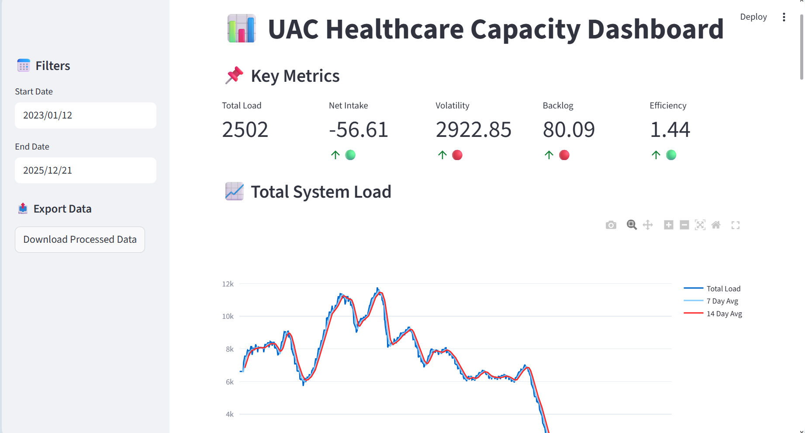

# 📊 UAC Healthcare Capacity Analytics Dashboard
🌐 **Live Dashboard:** https://your-app-name.streamlit.app  


---

## 🔍 Overview
This project provides a **data-driven analytical framework** to monitor system capacity and care load in the **Unaccompanied Alien Children (UAC) Program**.

It transforms raw operational data into **actionable insights**, enabling stakeholders to detect system stress, evaluate performance, and plan resources effectively.

---

## 🚀 Key Features

✔ 📌 KPI Dashboard (Total Load, Net Intake, Volatility, Backlog)  
✔ ⚖️ Inflow vs Outflow Analysis  
✔ 🚨 Stress Detection (Rolling Averages)  
✔ 🔍 Anomaly Detection (Z-Score Method)  
✔ 🔮 30-Day Forecasting (ARIMA Model)  
✔ 📤 Data Export (CSV + Summary Report)  
✔ 🎨 Interactive Dashboard (Streamlit + Plotly)  

---

## 🛠 Tech Stack

| Category | Tools |
|--------|------|
| Language | Python |
| Visualization | Streamlit, Plotly |
| Data Processing | Pandas, NumPy |
| Forecasting | Statsmodels (ARIMA) |

---

## 📊 Dashboard Preview



---

## ▶️ How to Run Locally

```bash
# Clone repository
git clone https://github.com/your-username/uac-healthcare-analytics.git

# Navigate to folder
cd uac-healthcare-analytics

# Install dependencies
pip install -r requirements.txt

# Run dashboard
streamlit run streamlit_app.py
